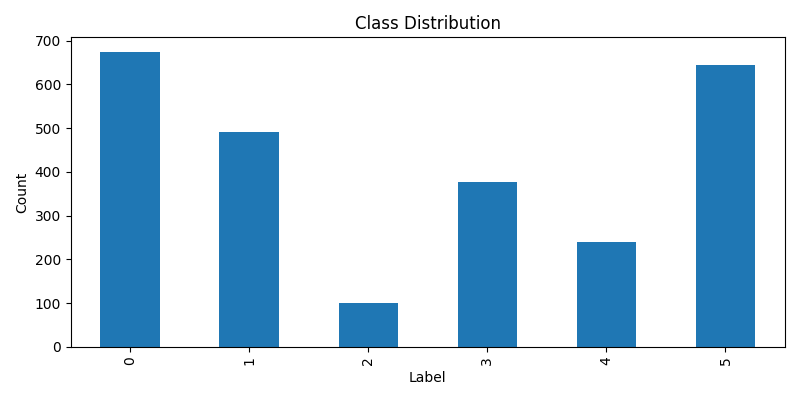
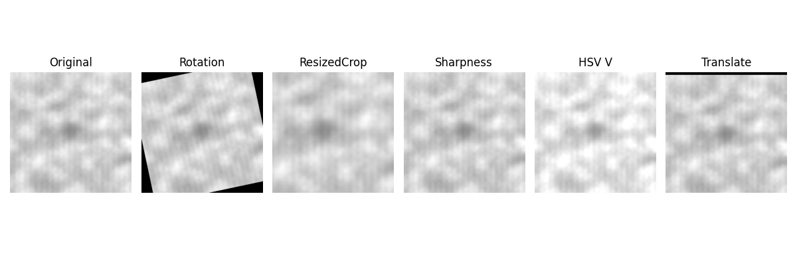
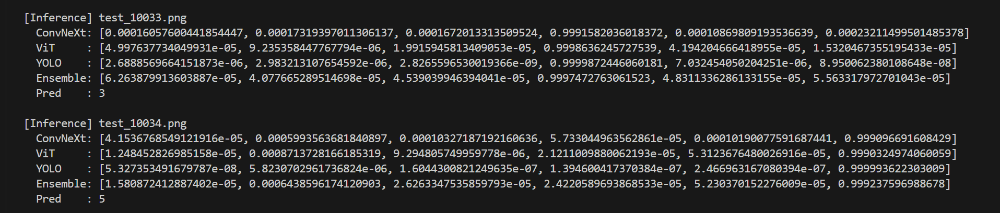
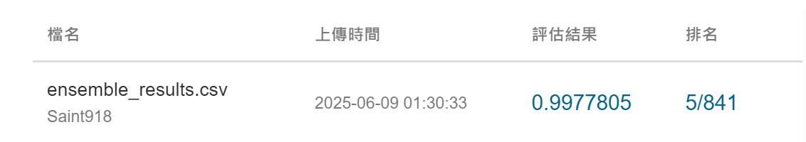

# AOI 瑕疵分類專案


本專案針對 AOI 缺陷影像進行多模型分類，整合ViT、ConvNeXt、YOLOv11-cls三種架構，進行5-fold Ensemble 與加權融合推論，以提升分類準確率。


## 資料集來源

資料集由工業技術研究院於 Aidea 平台提供，作為參賽者訓練分類模型之用。

🔗 [Aidea 資料集連結](https://aidea-web.tw/topic/285ef3be-44eb-43dd-85cc-f0388bf85ea4)


## 環境與套件

- **作業系統**：Ubuntu 24.04 LTS (Kernel 5.15, WSL2 on Windows 11)

- **Python 版本**：3.12.3

- **GPU**：NVIDIA GeForce RTX 4070

- **CUDA 版本**：12.1

### 套件版本

| 套件名稱         | 版本       |
|------------------|------------|
| PyTorch          | 2.5.1      |
| Torchvision      | 0.20.1     |
| Transformers     | 4.52.4     |
| Ultralytics YOLO | 8.3.146    |

---


## 資料集描述

本專案使用的資料集包含 AOI 缺陷影像，影像格式為 PNG，解析度統一為 **512x512** 像素。

- **訓練資料**：共 **2,528 張影像**
- **測試資料**：共 **10,142 張影像**
- **影像類別**：共 **6 類**
  - 1 類為正常影像（Normal）
  - 5 類為瑕疵影像（Defect Types）
 
### 資料分布:




## 資料增強

為了解決資料不平衡問題，引入多種資料增強技術，以提升模型的泛化能力與分類準確率。

###  增強方法

- `Rotation`：隨機旋轉影像角度
- `Resize & Crop`：調整尺寸並裁切
- `Sharpness`：調整影像銳利度
- **YOLOv8 內建增強**：
  - `HSV_V`：改變影像亮度（Value）
  - `Translate`：隨機平移影像位置

### 範例圖片:




## 模型
- **Vision Transformer**
- **ConvNeXt**
- **YOLO11-cls**


## 架構與融合策略
本專案整合三種模型架構進行分類推論，Vit架構參考另一位參加者採用的 multi-input 方法設計[^1]，從原本2-branch擴展為3-branch。加上採用 5 fold cross validation 訓練的 ConvNeXt 和 YOLO11-cls ，進行聯合推論。結合了多視角特徵學習能力與 5-fold Ensemble 的穩定性，有效提升分類準確率。

### 5-fold Ensemble

推論方式：5 折模型輸出經 softmax 後平均。

###  加權融合策略

最終分類機率由三種模型的預測結果加權平均：

$$
P = 0.6 \cdot P_{ViT} + 0.2 \cdot P_{ConvNeXt} + 0.2 \cdot P_{YOLO}
$$

---

###  推論過程演示




##  測試集推論結果

| 模型名稱           | Accuracy |
|--------------------|----------------|
| ViT-base (3-input) | 0.9967940      |
| ConvNeXt-B         | 0.9953144      |
| YOLO11m-cls        | 0.9945754      |
| **Ensemble**       | **0.9977805**  |

###  排名




## 執行方式

```bash
# 安裝依賴
pip install -r requirements.txt

# 執行推論
python inference.py --config config.yaml

```


## 參考資料

[^1]:[https://github.com/Aaron-Chang-AC/AIdea-Defect-Classifications-of-AOI]

